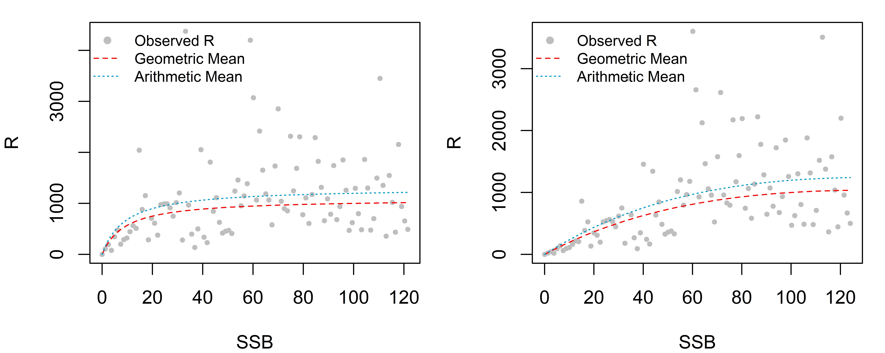
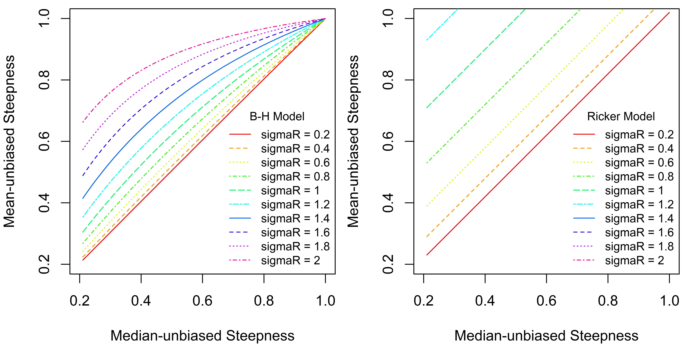
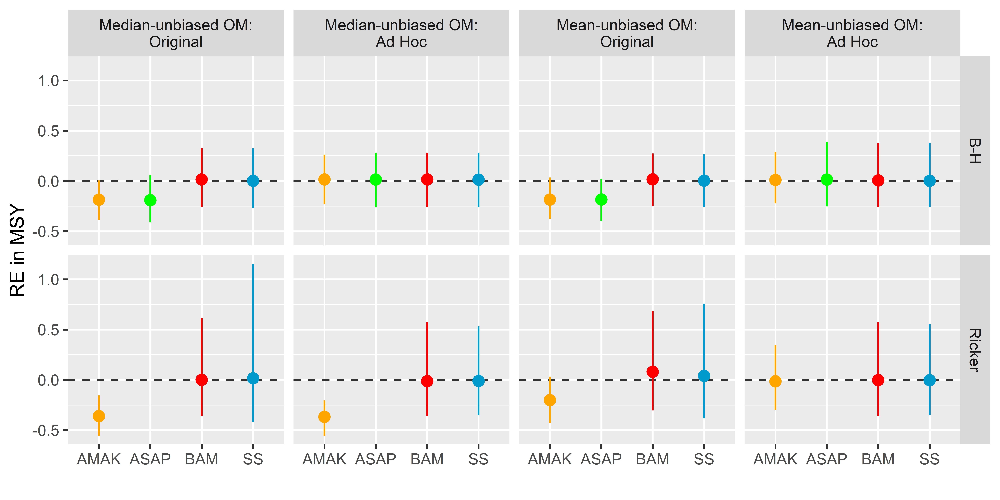
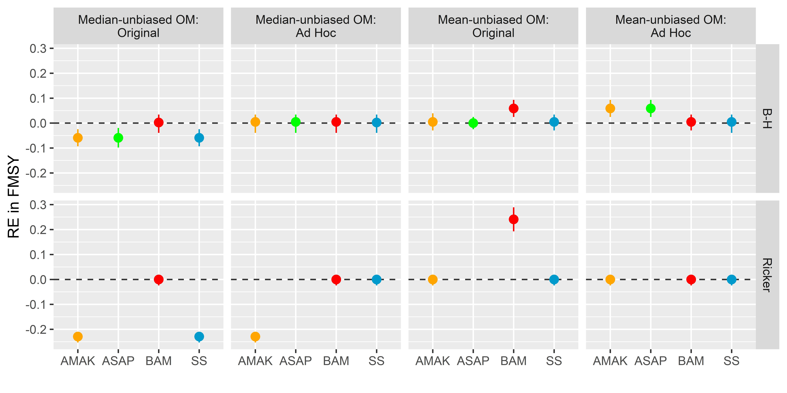
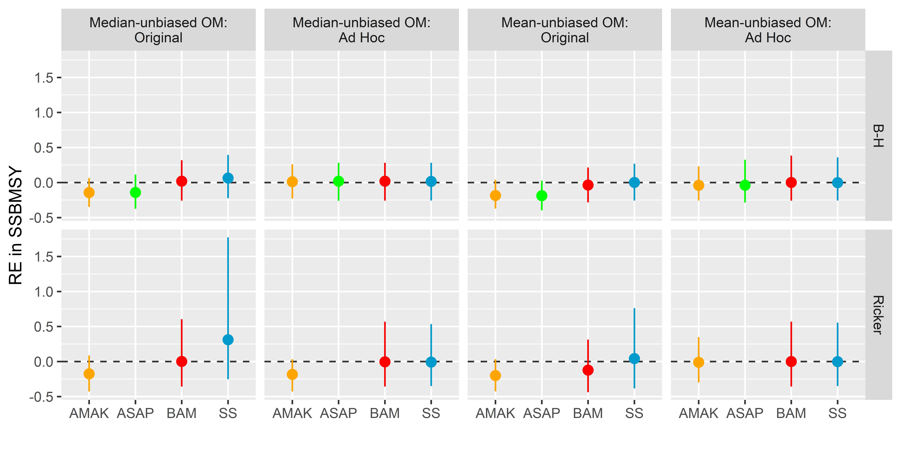

Recruitment Bias Adjustment
================

------------------------------------------------------
1. Geometric and arithmetic mean curves of recruitment

Median-unbiased unfished recruitment: 1000000 number of fish\
Median-unbiased steepness: 0.75\
Spawning biomass per recruit: 0.01025625\
Standard deviation of log recruitment: 0.6

 Fig 1. Geometric and arithmetic mean curves of recruitment.

------------------------------------------------------
2. Parameters associated with geometric and arithmetic mean curves of recruitment

Calculate corresponding mean-unbiased steepness given a fixed median-unbiased steepness and sigmaR:

 Fig 2. Median- and mean-unbiased steepness over various levels of recruitment variability.

------------------------------------------------------
3. Relative errors

Calculate corresponding mean-unbiased steepness given a fixed median-unbiased steepness and sigmaR:

 Fig 3A. Relative error in MSY.

 Fig 3B. Relative error in FMSY.  

 Fig 3C. Relative error in SSBMSY.    